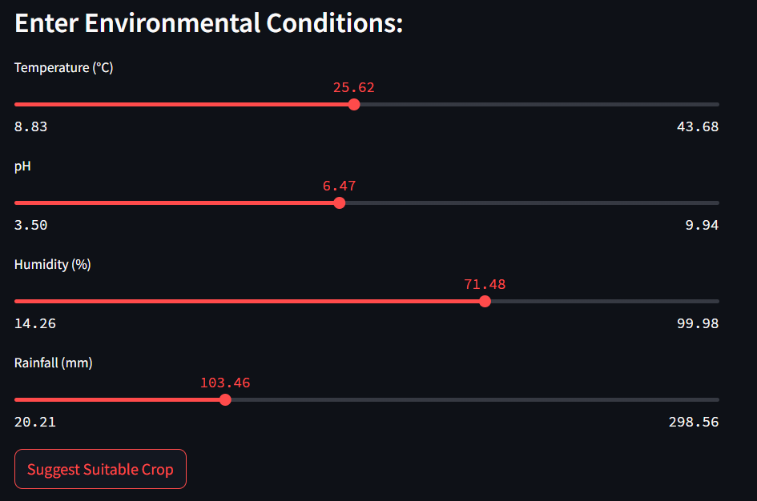
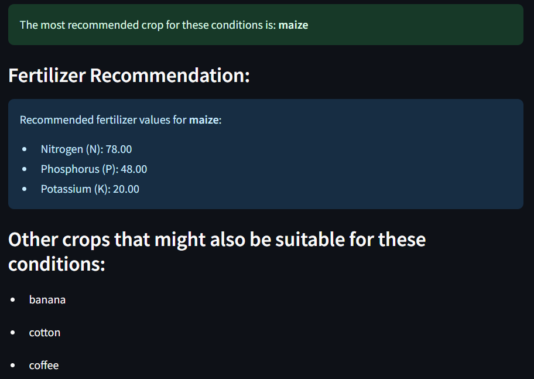

# 🌾 **Crop Analysis and Recommendation System** 🌾  

[](https://crop-analysis-and-recommendation-system.streamlit.app/)

---

## 🌱 **Introduction**  
The **Crop Analysis and Recommendation System** is an **interactive, data-driven web application** designed to assist farmers and researchers in making informed decisions about crop selection and management. By leveraging **machine learning** and **dynamic visualizations**, the system provides personalized crop recommendations based on key environmental factors such as:

- 🌡️ **Temperature**  
- 💧 **Humidity**  
- 📏 **pH Level**  
- 🌧️ **Rainfall**  

In addition to recommending the most suitable crops, the system also offers **nutrient recommendations** for each crop, including essential elements like **Nitrogen (N)**, **Phosphorus (P)**, and **Potassium (K)**. These recommendations are tailored to the specific environmental conditions, helping farmers optimize **soil fertility** and ensure that crops receive the proper nutrients for healthy growth. 

This system aims to promote **sustainable farming practices** by combining crop selection with **precise nutrient management**, leading to improved crop yield, efficient resource use, and healthier soils.

🔗 **Live Demo**: [Crop Analysis App](https://crop-analysis-and-recommendation-system.streamlit.app/)

---
## 🎯 **Objectives**  
- To evelop a smart system to recommend suitable crops.  
- To analyze soil and environmental conditions.  
- To provide visual insights for improved decision-making.  

---

## 🚀 **Project Overview**  
This project uses **machine learning** and interactive visualizations to predict the most suitable crop based on **temperature**, **pH**, **humidity**, and **rainfall**. It also recommends **fertilizer** suggestions to optimize soil health and crop growth.

### **Features:**  
1. 🌱 **Overall Crop Analysis**  
2. 🌾 **Individual Crop Insights**  
3. 🔍 **Crop Recommendation System**  
4. 🌟 **Feature Comparison Between Crops**  

---

## 📊 **Features**  

### 🌱 **Overall Crop Analysis**  
- Analyze trends and summary statistics of crops.  
- Visualize **correlation matrices**, **boxplots**, and **animated feature distributions**.  

### 🌾 **Individual Crop Analysis**  
- Get optimum weather conditions (Temperature, pH, Humidity, Rainfall).  
- Analyze recommended fertilizers (N, P, K values).  
- Visualize boxplots and trends for selected crops.  

### 🔍 **Crop Recommendation**  
- Suggest the most suitable crop for your input conditions (temperature, pH, humidity, and rainfall).  
- **Nutrient Recommendations** for the suggested crop:
  - **Nitrogen (N)**: [Recommended value for crop]  
  - **Phosphorus (P)**: [Recommended value for crop]  
  - **Potassium (K)**: [Recommended value for crop]  
- **Similar Crops** that can be grown under similar conditions:
  - [Similar Crop 1]  
  - [Similar Crop 2]  
  - [Similar Crop 3] 

### 🌟 **Crop Comparison**  
- Compare key features of two crops using **interactive Radar Charts**.  

---

## 💻 **Technologies Used**  
- **Programming Language**: Python  
- **Framework**: Streamlit  
- **Machine Learning**: Random Forest Classifier  
- **Visualization Tools**: Matplotlib, Seaborn, Plotly  
- **Dataset**: Environmental and Nutritional Crop Data  

---

## 🛠️ **Setup and Installation**  

### 1. **Clone the repository**  
```bash
git clone https://github.com/your_username/crop-analysis-recommendation.git
cd crop-analysis-recommendation
```

### 2. **Install dependencies**  
```bash
pip install -r requirements.txt
```

### 3. **Run the Streamlit app**  
```bash
streamlit run app.py
```

---

## 📂 **Project Structure**  
```plaintext
📁 Crop-Analysis-Recommendation
│-- app.py                 # Streamlit Application Code
│-- Crop_recommendation.csv # Dataset File
│-- requirements.txt       # Dependencies List
└── 📂 images             # Screenshots and Visuals
     │-- data_input.png
     │-- recommendation_output.png             
```

---

## 📈 **Model Performance**  
The **Random Forest Classifier** achieved:  
- **Accuracy**: 96.36%  

---

## 🌐 **Live Demo**  
🔗 **Try the app here** 👉 [Crop Analysis and Recommendation System](http://192.168.182.231:8501/)

---

## 📸 **Screenshots**  

### 1. **User Input for Crop Recommendation**  


### 2. **Crop Recommendation Output**  


---

## 🧑‍🎓 **Contributors**  
- [**Saikat Santra**](https://github.com/saikat37) (24AG66R06)  
- [**Kashish Sahu**](https://github.com/Kashish5678) (24AG66R08)  
🎓 *M.Tech, Agricultural Systems and Management*  
🏫 *Indian Institute of Technology Kharagpur* 

---

## 🤝 **Acknowledgments**  
I express my deepest gratitude to **Professor Subhamoy Mandal**, Assistant Professor at the **School of Medical Science and Technology (SMST)**, **Indian Institute of Technology Kharagpur**, for his invaluable guidance, support, and mentorship throughout this project.  

---

## 🔗 **Useful Links**  
- **Website Link**: [Streamlit App](https://crop-analysis-and-recommendation-system.streamlit.app/)  
- **Source Code**: [GitHub Repository](https://github.com/saikat37/Crop-Analysis-and-Recommendation-System)  

---

## 🌟 **Show Your Support**  
If you find this project helpful:  
- ⭐ **Star the repository**  
- 💬 Share your feedback or contributions!  
